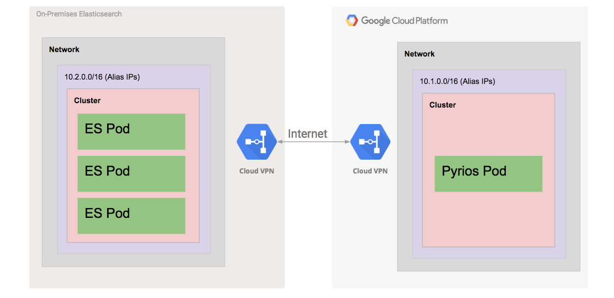

# Kubernetes Engine Enterprise Demo

  * [Introduction](#introduction)
  * [Architecture](#architecture)
     * [RBAC Setup](#rbac-setup)
     * [Build and Push Pyrios Docker Image](#build-and-push-pyrios-docker-image)
     * [Elasticsearch Cluster HA Set Up With Regional Persistent Disks](#elasticsearch-cluster-ha-set-up-with-regional-persistent-disks)
  * [Prerequisites](#prerequisites)
     * [Run Demo in a Google Cloud Shell](#run-demo-in-a-google-cloud-shell)
     * [Tools](#tools)
        * [Install Cloud SDK](#install-cloud-sdk)
        * [Install kubectl CLI](#install-kubectl-cli)
        * [Install Terraform](#install-terraform)
     * [Configure gcloud](#configure-gcloud)
  * [Enable the GCP Services](#enable-the-gcp-services)
  * [Run Terraform for Infrastructure Provisioning](#run-terraform-for-infrastructure-provisioning)
  * [Configure](#configure)
  * [Deploy Kubernetes Resources](#deploy-kubernetes-resources)
  * [Expose the pyrios Pod](#expose-the-pyrios-pod)
     * [Load Sample Data to the Elasticsearch Cluster](#load-sample-data-to-the-elasticsearch-cluster)
  * [Validation](#validation)
     * [Web Page User Interface](#web-page-user-interface)
  * [Teardown](#teardown)
  * [Troubleshooting](#troubleshooting)
  * [Relevant Material](#relevant-material)

## Introduction

[Kubernetes Engine](https://cloud.google.com/kubernetes-engine/) has made
the process of administering a k8s cluster extremely simple and allows teams to focus on
what matters instead of pain points like upgrading etcd.

This demo aims to show what a fully-featured project running in Kubernetes Engine
looks like. It includes Elasticsearch, a very popular open-source project for indexing and searching data. Also
included are 2 demonstration applications that are used to show some advanced features in GCP and a fully operational
Bazel pipeline and workflow.

Some of the highlights included are:

* Role-based access control
* k8s services
* Using Cloud VPN to connect disparate networks
* Terraform as IAC
* Using Bazel build tool
* Using Stackdriver tracing
* Using Stackdriver monitoring

## Architecture

The demo does not use an actual on-prem data center so we have to emulated
an on-prem data center by creating a separate VPC network.  We are using two different
GKE clusters.  The first GKE cluster hosts a deployment of an Elasticsearch database,
and the second GKE cluster hosts an example application.  The GKE cluster that
hosts Elasticsearch emulates an GKE On-Prem cluster running in your data center.

The two different networks, that contain the GKE clusters, are connected via
[Cloud VPN](https://cloud.google.com/vpn/docs/). It's common practice to
connect remote networks together with VPNs and the cloud is no
exception.
Other options exist including [GCP Interconnect](https://cloud.google.com/interconnect/).

You can setup a Cloud VPN to connect your cloud VPC to your
on-prem data center. We use
[forwarding rules](https://cloud.google.com/compute/docs/load-balancing/network/forwarding-rules)
to direct traffic sent to the public IP addresses to the gateways. The demo
creates an [IPSec tunnel](https://en.wikipedia.org/wiki/IPsec#Tunnel_mode) between the
gateways using a shared secret. A VPN gateway with subnet routes and [traffic
selectors](https://cloud.google.com/vpn/docs/concepts/choosing-networks-routing#static-routing-networks),
ensures the data center traffic egresses. All of this configuration can be found
in the ['datacenter' module](modules/datacenter/main.tf) of this demo.

The Elasticsearch pods are accessed via their Cluster IPs which is within the
[Alias IP range](https://cloud.google.com/vpc/docs/alias-ip) of the VPC.
Once the networks are connected the application is able to connect to
the 'on-prem' Elasticsearch cluster.



The 'on-prem' datacenter has an eight pod Elasticsearch cluster running client,
master, and data pods. The data pods are deployed as a StatefulSet.
The nodes in the GKE cluster are type n1-standard-4. The manifests are based on the
[pires Elasticsearch project](https://github.com/pires/kubernetes-elasticsearch-cluster).
We updated the memory and added pod disruptions budgets.

In order to expose the on-premise Elasticsearch as a *service* to the
cloud Kubernetes Engine cluster, we need to expose it via an Internal Load
Balancer (ILB).  By doing so, the Elasticsearch cluster can be accessed
by any application running in the cloud. The traffic will travel
through the VPN tunnel between the cloud network and the on-prem network.
`es-svc.yaml` shows how it is implemented by a kubernetes annotation,
`cloud.google.com/load-balancer-type: "Internal"`, which specifies that
an internal load balancer is to be configured. Please refer to [Creating
an internal load
balancer](https://cloud.google.com/kubernetes-engine/docs/how-to/internal-load-balancing#create)
for details.

The cloud datacenter contains the second GKE cluster running a single node
with a single pod in it. The pod is running a custom application called
'pyrios' It acts as a proxy to the on-prem Elasticsearch cluster.

`pyrios` is a minimalist proxy server for Elasticsearch. The key idea is
to proxy the REST request from the cloud Kubernetes Engine cluster to the on-prem
Elasticsearch cluster.

The demo includes a simple UI that is fed by data from Elasticsearch. It shows
the same information that **validate.sh** shows. You can read more in the
[Web Page User Interface](#web-page-user-interface) section.

### RBAC Setup

[ Role-Based Access Control](https://cloud.google.com/kubernetes-engine/docs/how-to/role-based-access-control)
is used for authenticating Elasticsearch data node's graceful shutdown script.
During the shutdown, the shutdown script (`pre-stop-hook.sh` in
manifests/configmap.yaml) needs to access the stateful set's status in
the on-prem Kubernetes Engine cluster. Hence, we need to create a service
account, cluster role and cluster role binding for this to work.
Under `manifests` folder
* `clusterrole.yaml`: a ClusterRole `elasticsearch-data` for reading statefulset
* `service-account.yaml`: a ServiceAccount `elasticsearch-data`
* `clusterrolebinding.yaml`: a ClusterRoleBinding `elasticsearch-data` to bind
the cluster role and service account declared in the above.

### Elasticsearch Cluster HA Set Up With Regional Persistent Disks

The Elasticsearch cluster uses [regional persistent disks](https://cloud.google.com/compute/docs/disks/#repds) to improve
its storage resiliency. These disks are replicated across multiple zones in a
region. The Elasticsearch cluster in the demo uses the 'regional-pd'
volume type for its data nodes. Once the clusters are setup you can see
for yourself with the following command. Note that the LOCATION_SCOPE
says 'region'.

Execute:

```console
gcloud beta compute disks list --filter="region:us-west1"
```

Example output:

```console
NAME                                                             LOCATION     LOCATION_SCOPE  SIZE_GB  TYPE         STATUS
gke-on-prem-cluster-f1-pvc-9cf7b9b3-6472-11e8-a9b6-42010a800140  us-west1  region          13       pd-standard  READY
gke-on-prem-cluster-f1-pvc-b169f561-6472-11e8-a9b6-42010a800140  us-west1  region          13       pd-standard  READY
gke-on-prem-cluster-f1-pvc-bcc115d6-6472-11e8-a9b6-42010a800140  us-west1  region          13       pd-standard  READY
```

## Prerequisites

### Run Demo in a Google Cloud Shell

Click the button below to run the demo in a [Google Cloud Shell](https://cloud.google.com/shell/docs/).

[](https://console.cloud.google.com/cloudshell/open?cloudshell_git_repo=https://github.com/GoogleCloudPlatform/gke-enterprise-demo.git&amp;cloudshell_image=gcr.io/graphite-cloud-shell-images/terraform:latest&amp;cloudshell_tutorial=README.md)


All the tools for the demo are installed. When using Cloud Shell execute the following
command in order to setup gcloud cli. When executing this command please setup your region
and zone.

```console
gcloud init
```

### Tools

1. [Terraform >= 0.11.7](https://www.terraform.io/downloads.html)
2. [Google Cloud SDK version >= 204.0.0](https://cloud.google.com/sdk/docs/downloads-versioned-archives)
3. [kubectl matching the latest GKE version](https://kubernetes.io/docs/tasks/tools/install-kubectl/)
4. bash or bash compatible shell
5. [jq](http://stedolan.github.io/jq/download/)
6. [bazel](https://docs.bazel.build/versions/master/install.html)
7. A Google Cloud Platform project where you have permission to create
   networks

This demo has been tested with macOS and Cloud Shell.

You can obtain a [free trial of GCP](https://cloud.google.com/free/) if you need one

#### Install Cloud SDK

The Google Cloud SDK is used to interact with your GCP resources.
[Installation instructions](https://cloud.google.com/sdk/downloads) for multiple platforms are available online.

#### Install kubectl CLI

The kubectl CLI is used to interteract with both Kubernetes Engine and kubernetes in general.
[Installation instructions](https://cloud.google.com/kubernetes-engine/docs/quickstart)
for multiple platforms are available online.

#### Install Terraform

Terraform is used to automate the manipulation of cloud infrastructure. Its
[installation instructions](https://www.terraform.io/intro/getting-started/install.html) are also available online.

#### Install jq

jq is used for parsing JSON output from resources within this demo.  Its [installation instructions](http://stedolan.github.io/jq/download/) are available online.

#### Install Bazel

Bazel is the build tool used to build the pyrios images used in the demo. Its [installation instructions](https://docs.bazel.build/versions/master/install.html) are available online. At time of writing, the latest Bazel version tested is 0.24.0.

### Configure gcloud

Before running any commands, configure gcloud with the project you wish
to use for this demo:

```console
gcloud config set project <PROJECT_ID>
```

## Enable the GCP Services

Please enable the GCP services by running `make bootstrap`. The command
runs like the following:

```console
make bootstrap
```

Example output:

```console
gcloud services enable \
	  cloudresourcemanager.googleapis.com \
	  compute.googleapis.com \
	  container.googleapis.com \
	  cloudbuild.googleapis.com \
	  containerregistry.googleapis.com
Waiting for async operation operations/tmo-acf.e898de22-74cb-4f9c-9811-fd66c0f57173 to complete...
Operation finished successfully. The following command can describe the Operation details:
 gcloud services operations describe operations/tmo-acf.e898de22-74cb-4f9c-9811-fd66c0f57173
Waiting for async operation operations/tmo-acf.33b02d7e-6e5f-489f-a764-083faa63c367 to complete...
Operation finished successfully. The following command can describe the Operation details:
 gcloud services operations describe operations/tmo-acf.33b02d7e-6e5f-489f-a764-083faa63c367
Waiting for async operation operations/tmo-acf.99f6f42d-b98a-4ea2-a924-db6e219d3b62 to complete...
Operation finished successfully. The following command can describe the Operation details:
 gcloud services operations describe operations/tmo-acf.99f6f42d-b98a-4ea2-a924-db6e219d3b62
Waiting for async operation operations/tmo-acf.d46ed8d8-9c98-4e42-a931-56376d788104 to complete...
Operation finished successfully. The following command can describe the Operation details:
 gcloud services operations describe operations/tmo-acf.d46ed8d8-9c98-4e42-a931-56376d788104
Waiting for async operation operations/tmo-acf.a720d526-cec8-4b29-b38c-b197b9597de4 to complete...
Operation finished successfully. The following command can describe the Operation details:
 gcloud services operations describe operations/tmo-acf.a720d526-cec8-4b29-b38c-b197b9597de4
```

## Run Terraform for Infrastructure Provisioning

Please run `make terraform` to provisions the infrastructure. The first
time you run this code, make will initialize terraform in the project
directory:

```console
make terraform
```

Example output:

```console
terraform fmt
terraform validate -check-variables=false
terraform init
Initializing modules...
- module.cloud
  Getting source "modules/datacenter"
- module.on-prem
  Getting source "modules/datacenter"
```

Initializing provider plugins...
- Checking for available provider plugins on https://releases.hashicorp.com...
- Downloading plugin for provider "google" (1.14.0)...

Terraform has been successfully initialized!

You may now begin working with Terraform. Try running "terraform plan" to see
any changes that are required for your infrastructure. All Terraform commands
should now work.

If you ever set or change modules or backend configuration for Terraform,
rerun this command to reinitialize your working directory. If you forget, other
commands will detect it and remind you to do so if necessary.

VPN tunnels need a shared secret so they can encrypt their communications. The shared secret
is generated by Terraform as a random string.

After the steps finished successfully, there will be one multi zone Kubernetes Engine
cluster to simulate an on-prem data center, as well a single zone Kubernetes Engine
cluster for cloud.

## Configure

Run `make configure`, which will generate an environment specific `k8s.env` to be
shared among the shell scripts.

```console
make configure
```

Example output:

```
Fetching cluster endpoint and auth data.
kubeconfig entry generated for on-prem-cluster.
Fetching cluster endpoint and auth data.
kubeconfig entry generated for cloud-cluster.
```

## Deploy Kubernetes Resources

To invokes the scripts to create all Kubernetes objects, run

```console
make create
```

During the creation of Kubernetes objects, a Bazel build will be triggered and new images will be created and published.

To avoid authentication error please run
```console
gcloud auth configure-docker
```

You should see output similar to this:
```
clusterrolebinding.rbac.authorization.k8s.io/cluster-admin-binding created
service/elasticsearch-discovery created
service/elasticsearch created
deployment.apps/es-master created
Waiting for deployment "es-master" rollout to finish: 0 of 3 updated replicas are available...
```

## Expose the `pyrios` Pod

We need to make the `pyrios` pod accessible so that we can load sample
Shakespeare data and validate the Elasticsearch API via `pyrios`. Run
`make expose` in a separate terminal. `make expose` will cause kubectl to use
SSH to create a tunnel that forwards local traffic on port 9200 to the remote
node running the pyrios pod on port 9200. The pyrios pod forwards the API
request to the on prem Elasticsearch cluster and passes the results back.

```console
make expose
```

Example output:

```console
Forwarding from 127.0.0.1:9200 -> 9200
Handling connection for 9200
```

kubectl will not return on its own. The tunnel remains open until you end the
process with Ctrl+C.

### Load Sample Data to the Elasticsearch Cluster

Run `make load` loads the sample *shakespeare.json* into the
Elasticsearch cluster via Elasticsearch Bulk API.

```console
make load
```

Example output:

```console
Loading the index into the Elasticsearch cluster
{"acknowledged":true,"shards_acknowledged":true,"index":"shakespeare"}
Loading data into the Elasticsearch cluster
```

## Validation

To validate the Elasticsearch cluster by invoking its
REST API, run

```console
make validate
```

The scripts checks cluster version, health, sample data as well as a
couple of types of queries (called query DSL in Elasticsearch term)
on the sample data.


Example output:

```console
Elasticsearch version matched
Elasticsearch cluster status is green
Shakespeare data has the expected number of shard(s)
Shakespeare match_all query has the expected numbers of hits
Shakespeare match query on speaker LEONATO has the expected numbers of hits
```

### Web Page User Interface

The web-based UI is equivalent to the **validate.sh** script. It queries
Elasticsearch through the Pyrios proxy and verifies that all the data looks
correct.

The web-based UI also demonstrates usage of Stackdriver Tracing and custom
Stackdriver metrics. You can view the UI by running

```console
make expose-ui
```

You will need to have port 8080 available on your machine before running
`make expose-ui`. In your browser visit
[localhost:8080](http://localhost:8080). Each
time the UI page is refreshed it creates traces and metrics.

The custom metric is called `custom/pyrios-ui/numberOfLeonatoHits` and can
be found in the global resource.

There is a trace of `pyrios-ui`, which indicates the UI being loaded and making numerous calls
to pyrios.


## Teardown

Teardown is fully automated. The teardown script deletes every resource
created in the deployment script.

It will run the following commands:
1. cloud-destroy.sh - destroys the pyrios deployment
2. on-prem-destroy.sh - destroys the Elasticsearch deployments
3. terraform destroy - it prompts you for a shared secret for VPN and
   then destroys the all the project infrastructure

In order to teardown, run `make
teardown`.

You should see output similar to this:
```
deployment.apps "pyrios" deleted
service "pyrios" deleted
deployment.apps "pyrios-ui" deleted
configmap "esconfig" deleted
networkpolicy.networking.k8s.io "pyrios-ui-to-pyrios" deleted
Switched to context "gke_jmusselwhite-sandbox_us-west1-a_on-prem-cluster".
clusterrole.rbac.authorization.k8s.io "elasticsearch-data" deleted
clusterrolebinding.rbac.authorization.k8s.io "elasticsearch-data" deleted
configmap "es-cm" deleted
deployment.apps "es-client" deleted
poddisruptionbudget.policy "elasticsearch-data" deleted
storageclass.storage.k8s.io "repd-fast" deleted
statefulset.apps "es-data" deleted
service "elasticsearch-data" deleted
service "elasticsearch-discovery" deleted
```


## Troubleshooting

1. `default credentials` Error:

    ```console
    * provider.google: google: could not find default credentials. See https://developers.google.com/accounts/docs/application-default-credentials for more information.
    ```

    Set your
    [credentials](https://www.terraform.io/docs/providers/google/index.html#configuration-reference)
    through any of the available methods. The quickest being:

    ```console
    gcloud auth application-default login
    ```

2. `make create` image publication error:

   ```console
   CRITICAL:root:Error publishing provided image: Bad status during token exchange: 401
   ```
   Provide credentials for docker to [push image](https://cloud.google.com/container-registry/docs/pushing-and-pulling).  This boils down:

   ```console
   gcloud auth configure-docker
   ```

3. `make expose-ui` is not working:

    Make sure that port 8080 is not being used by another process on your
    machine. It's a very common port for development servers, etc.

## Relevant Material

* [Creating an internal load
  balancer](https://cloud.google.com/kubernetes-engine/docs/how-to/internal-load-balancing#create)
* [Get higher availability with Regional Persistent Disks on Google
  Kubernetes
  Engine](https://cloudplatform.googleblog.com/2018/05/Get-higher-availability-with-Regional-Persistent-Disks-on-Google-Kubernetes-Engine.html?m=1)
* [pires Elasticsearch
  project](https://github.com/pires/kubernetes-elasticsearch-cluster)
* [ElasticSearch Cluster Sample
  data](https://www.elastic.co/guide/en/kibana/current/tutorial-load-dataset.html)
* [ElasticSearch bulk load
  API](https://www.elastic.co/guide/en/elasticsearch/reference/current/docs-bulk.html)
* [ElasticSearch Query DSL](https://www.elastic.co/guide/en/elasticsearch/reference/6.2/query-dsl-match-query.html)

**This is not an officially supported Google product**
